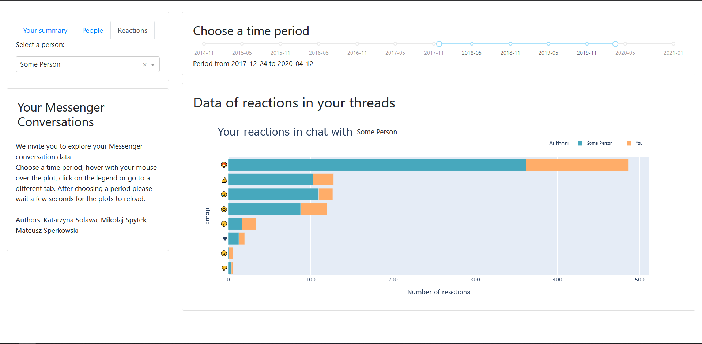

<!-- https://github.com/othneildrew/Best-README-Template -->
<!-- TABLE OF CONTENTS -->

  
<h2 style="display: inline-block">Table of Contents</h2>

  <ol>
    <li>
      <a href="#about-the-project">About The Project</a>
    </li>
    <li>
      <a href="#getting-started">Getting Started</a>
      <ul>
        <li><a href="#download-your-data">Download your Data</a></li>
        <li><a href="#installation">Installation</a></li>
      </ul>
    </li>
    <li><a href="#usage">Usage</a></li>
    <li><a href="#contact">Contact</a></li>
  </ol>

<!-- ABOUT THE PROJECT -->
## About The Project

This project was created as the final submission for course Data Visualization Techniques (Techniki Wizualizacji Danych). Created by Katarzyna Solawa, Mateusz Sperkowski and Mikolaj Spytek. The dashboard uses data downloaded from Facebook Messenger and visualizes it for the user.

<!-- GETTING STARTED -->
## Getting Started

To get a local copy up and running follow these simple steps.

### Download your data
1. In Facebook go to: Settings&Privacy > Settings > Your Facebook Information > Download your information.

2. Select "Format: JSON". Additionally it is recommended to set Quality to low and choose only Messages, for faster download.

3. Put the downloaded file into Python_scripts folder and unzip it.

### Installation

1. Clone the repo
   
   git clone https://github.com/MattS0000/Messenger_Dashboard.git
   
2. Install requirements using pip
   
   pip install requirements.txt
  

<!-- USAGE EXAMPLES -->
## Usage

First run generate.py script, which converts json data files into a csv. Optionally one can use clear_messages_dir.py delete the non necessary, memory heavy files such as photos and videos from the downloaded data. After that use plots.py to run the dashboard. It runs on local site: http://127.0.0.1:8050/

### First Page
First page presents summaries of all conversations for the user.

### Second Page
Second page shows a summary for the chosen conversation, together with a wordcloud of used words by both participants.

### Third Page
Third page shows how in the chosen conversation, participants used emoticons to react to each other's messages.

<!-- CONTACT -->
## Contact

Katarzyna Solawa - [GitHub](https://github.com/solawak)

Mateusz Sperkowski - [GitHub](https://github.com/MattS0000)

Mikolaj Spytek - [GitHub](https://github.com/mikolajsp)

Project Link: [https://github.com/MattS0000/Messenger_Dashboard](https://github.com/MattS0000/Messenger_Dashboard)

